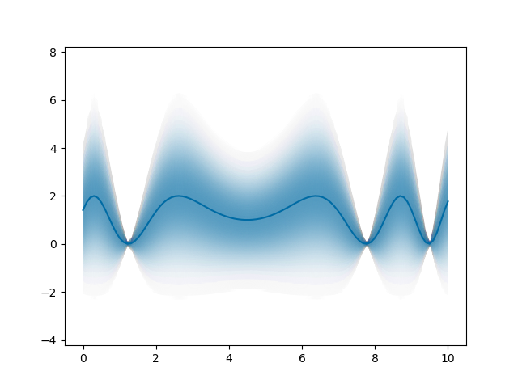
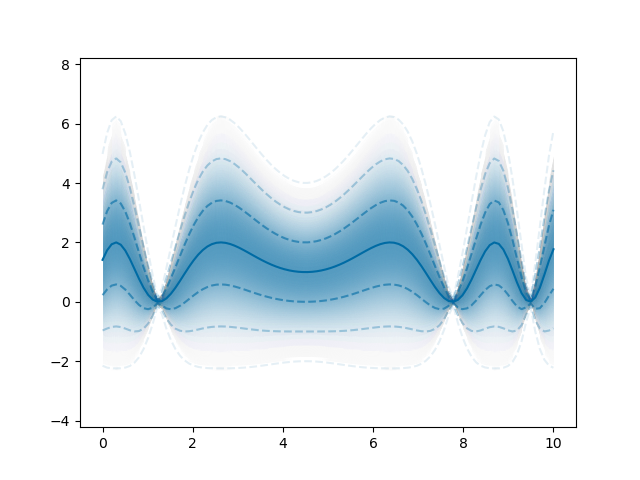

# mpl-gaussian-fillbetween

Shade region around line with a gaussian transparency. This can be used to indicate the uncertainty round a function.

## Requirements

+ matplotlib
+ numpy

## Use

There is a single function which shades the region around a curve with a transparency following a gaussian distribution. The distribution is normalised to a value of one at the centre. The distribution is divided into small blocks. The magnitude of the gaussian is calculated for the midpoint of the block, and the region between the blocks filled with that value.

## Examples

The first example shows the shading. The second example adds dashed lines at 1, 2 and 3 standard deviations from the line.

